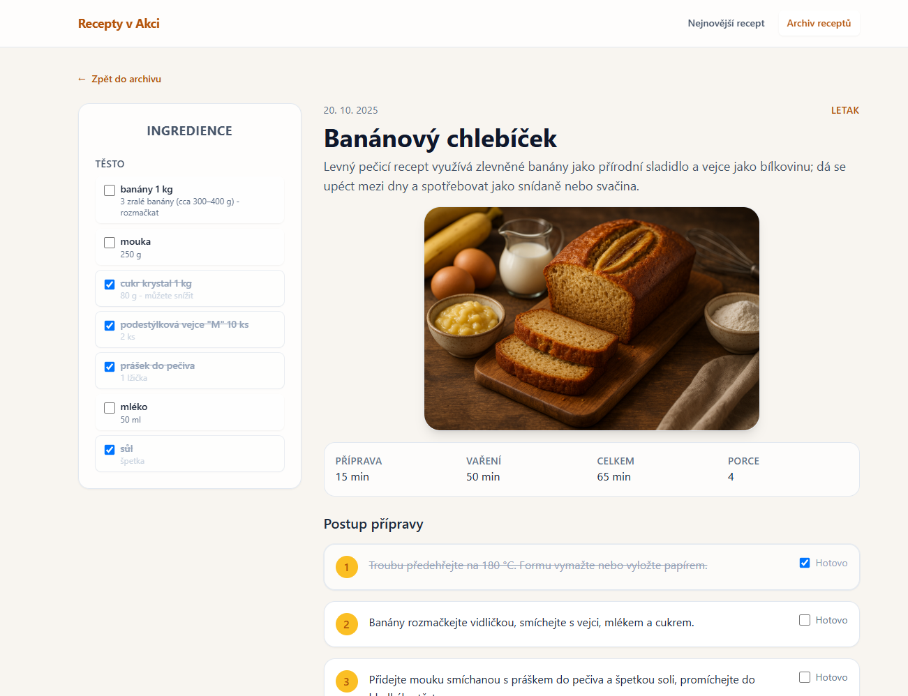
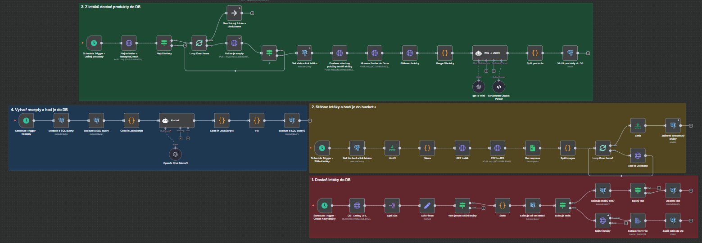

# Recepty v Akci

This project was created as a personal interest of mine to explore n8n automation. 
Everything used in this project is **selfhosted** namely nginx, supabase, Stirling-PDF and n8n. 

Site is accessible @ [www.ReceptyVAkci.com](https://www.receptyvakci.com "Visit")

[](images/site-showcase.png)

Recepty v Akci is a React and TypeScript frontend that showcases the latest featured recipe from a supermarket leaflet and keeps a browsable archive of past dishes. The UI mirrors the printed layout with a dedicated ingredient column, step-by-step instructions, and responsive Tailwind styling. Data can come from Supabase or fall back to bundled mock content so the app stays usable offline.

## Core Features
- Landing page that highlights the newest recipe with ingredient sections, hero image, timing metadata, and preparation steps.
- Recipe archive (`/recipes`) with pagination, loading skeletons, and error handling for Supabase outages.
- Detail view per recipe slug (`/recipes/:slug`) that supports deep linking and quick navigation back to the archive.
- Data fetching centralised in `src/lib/recipesApi.ts` with TanStack Query caching and automatic mock fallback when Supabase credentials are absent.
- Component-driven layout (`IngredientList`, `RecipeSteps`, `RecipeCard`) designed to match the leaflet-inspired split view.

## Automation Pipeline
Behind the scenes a self-hosted n8n instance orchestrates a daily content pipeline that keeps the site fresh and demonstrates how the project blends automation, AI, and web engineering:
- Every morning n8n downloads individual pages from the supermarket flyers, converts the PDFs to JPGs, and stores the images in a Supabase storage bucket.
- An agent processes each stored page, scrapes all visible products, and writes a structured JSON payload into the `produkty` table.
- A follow-up agent consumes the product feed, proposes recipe combinations, and saves curated recipe JSON documents into the `recipes` table.
- The frontend reads from the `recipes` table (via Supabase or mock fallback), so new flyer pages flow automatically from data extraction to the live React experience with zero manual touch.

[](images/n8n-showcase.png)

## Tech Stack
- React 18 with Vite and TypeScript.
- React Router 6 for routing.
- TanStack Query 5 for async state.
- Tailwind CSS for utility-first styling.
- Supabase JS client for backend access with local mock data as a safety net.
- Vitest and Testing Library for unit and integration coverage.

## Architecture Overview
- `src/App.tsx` wires together the shared `AppLayout` and the route map.
- UI primitives live under `src/components/`, including the header, recipe layout, ingredient list, and cards.
- Query hooks in `src/hooks/` (`useLatestRecipe`, `useRecipeArchive`, `useRecipeBySlug`) wrap `recipeQueries` for pages to consume.
- The data layer in `src/lib/` contains Supabase configuration, mock data, and query key definitions.
- Recipe domain types are defined in `src/types/recipe.ts` to keep component props strict.
- Page-level components live in `src/pages/`, with colocated tests in `src/pages/__tests__/`.

## Getting Started
### Prerequisites
- Node.js 18+ and npm (or another Node package manager).
- Access to the Supabase instance at `https://supabase.jakubdolenek.xyz` or your own Supabase credentials.

### Setup
1. Copy `.env.example` to `.env`. The defaults target the shared Supabase stack; adjust only if you run a different backend.
2. Install dependencies with `npm install`.
3. Start the development server with `npm run dev` and open the printed URL. Restart the server after changing environment variables so Vite reloads them.

### Available Scripts
- `npm run dev` – start the Vite dev server.
- `npm run build` – type-check and build production assets.
- `npm run preview` – preview the production build locally.
- `npm run lint` – run ESLint across `src`.
- `npm run test` / `npm run test:watch` – execute Vitest suites once or in watch mode.

## Environment Variables
- `VITE_SUPABASE_URL` – Supabase project URL.
- `VITE_SUPABASE_ANON_KEY` – Supabase anonymous key.

If either value is missing, the app logs a warning and transparently swaps to the mock data defined in `src/lib/mockData.ts`, ensuring the UI remains functional during development or outages.

## Project Structure
```
src/
  components/      # Layout and recipe presentation building blocks
  hooks/           # TanStack Query hooks that expose recipe queries
  lib/             # Supabase client, API wrappers, query keys, mock data
  pages/           # Route-level components and tests
  test/            # Shared test utilities
  types/           # Recipe domain TypeScript definitions
docs/              # Architecture notes, dev workflow, Supabase schema
```

## Testing and Quality
- Vitest and Testing Library are configured with helpers in `src/test/testUtils.tsx` for rendering providers.
- ESLint and Prettier keep the codebase consistent; run `npm run lint` before opening a PR.

## Additional Documentation
- `docs/architecture.md` details component structure and data flow.
- `docs/development.md` captures local environment tips, including how to restart the Supabase Docker stack.
- `docs/supabase-schema.sql` describes the `recipes` table and seed data expected by the frontend.
- `AGENTS.md` explains automation conventions and environment details for collaborators.
